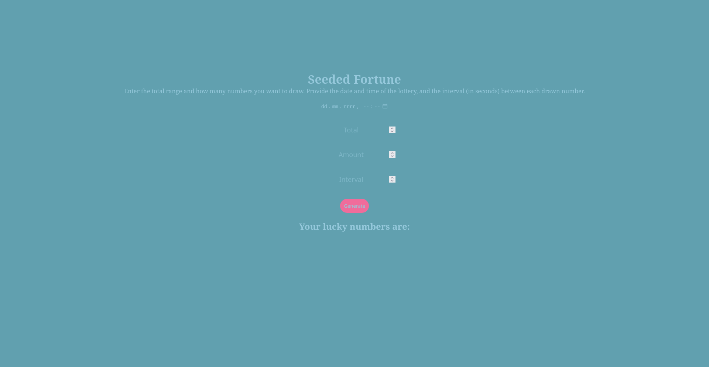

# 🎰 Seeded Fortune

A simple web app built with HTML, CSS, and JavaScript to generate deterministic lottery numbers based on a date and interval.  
The numbers are drawn using a seeded pseudorandom number generator — meaning the same input will always produce the same output.

 <!-- możesz podmienić lub usunąć, jeśli nie masz screena -->

---

## 🌱 How it works

You input:
- **Total** – the range of numbers to draw from (e.g. 50),
- **Amount** – how many numbers you want to draw (e.g. 6),
- **Date and time** – the seed source,
- **Interval** – number of milliseconds added to the seed for each next number.

The app uses the [Mulberry32](https://github.com/bryc/code/blob/master/jshash/PRNGs.md#mulberry32) PRNG to produce predictable results.

---

## 🚀 Usage

1. Open the app in a browser ([view the live version here](https://loriv2.github.io/seeded-fortune/)).
2. Fill in all the fields:
   - Date/time
   - Total
   - Amount
   - Interval
3. Click **Generate**
4. Your seeded "lucky numbers" will appear below.

---

## 🧪 Example

If you input:

- Date: `2025-05-01T15:00`
- Total: `49`
- Amount: `6`
- Interval: `1000`

You will always get the same 6 numbers. It's like a *time-locked* RNG.

---

<pre> ## 📁 Structure ``` / ├── index.html # Main UI ├── style.css # Styling ├── script.js # RNG logic └── README.md # You're here! ``` </pre>

---

## ⚙️ Technologies

- HTML5
- CSS3 (basic responsive design)
- JavaScript (Vanilla, no libraries)

---

## 🧠 Credits

Pseudorandom generator: **Mulberry32** by [bryc](https://github.com/bryc/code/blob/master/jshash/PRNGs.md)  
Created by [Lori](https://github.com/LoriV2)

---

## 🪄 License

MIT License — feel free to use, modify and share.
